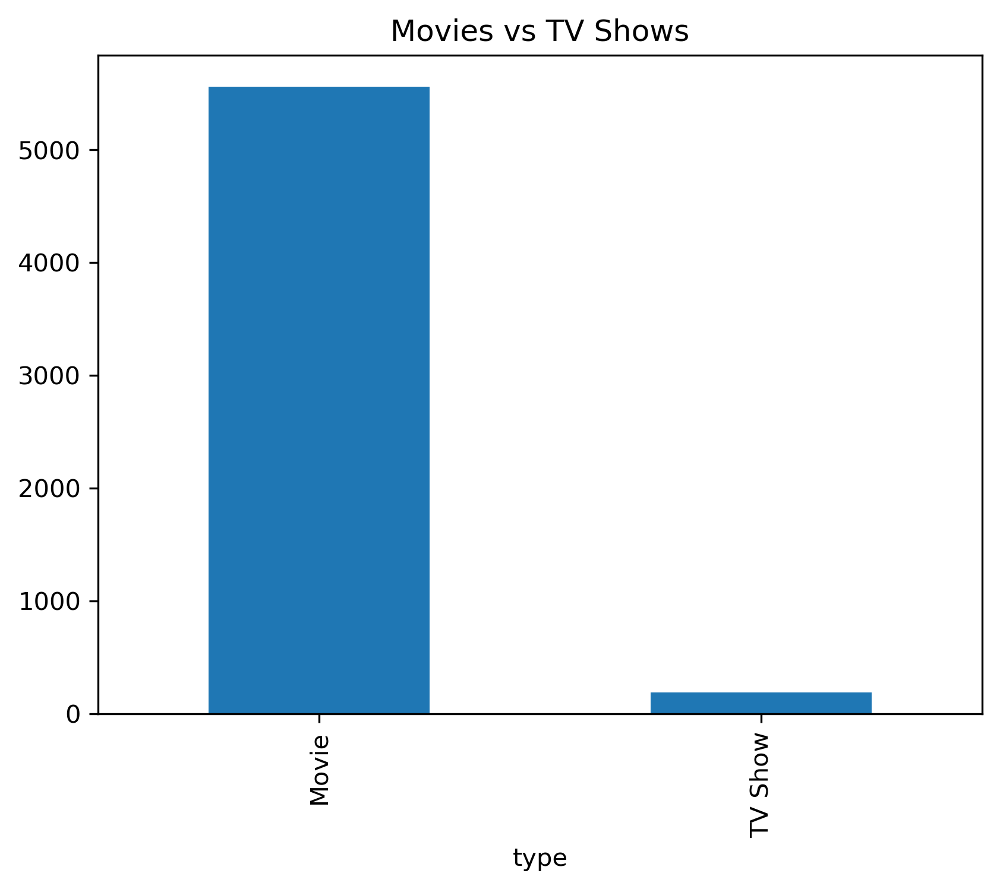
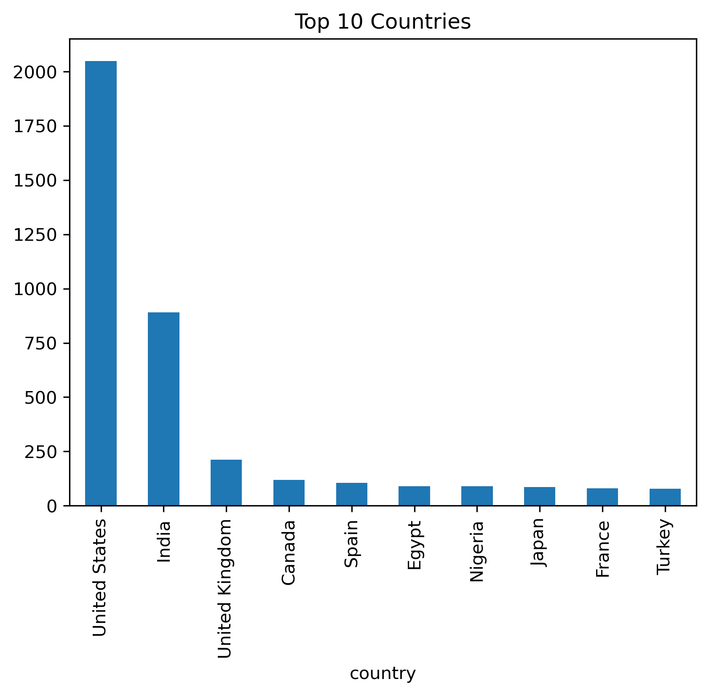
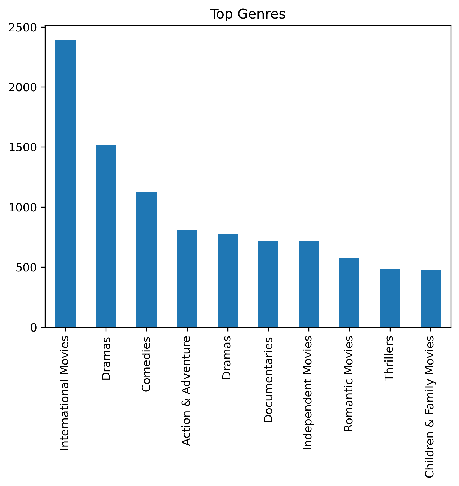
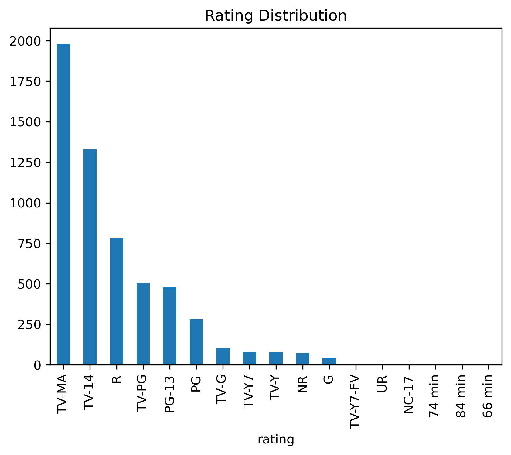

# Netflix Data Analysis

## Project Overview
Analyze Netflix dataset to identify trends and insights.

## Tools Used
- Python
- Pandas
- Matplotlib
- Seaborn

## Key Insights
- Movies dominate Netflix content compared to TV Shows.
- United States produces the highest amount of content.
- Drama and Comedy are the most popular genres.
- Netflix content additions increased rapidly after 2015.
- TV-MA is one of the most common ratings.

## Dataset
Kaggle Netflix Dataset


## Project Structure
```text
netflix-data-analysis/
│
├── data/
│   └── netflix_titles.csv
│
├── notebook/
│   └── netflix_analysis.ipynb
│
├── images/
│   ├── movies_vs_tvshows.png
│   ├── top_countries.png
│   ├── top_genres.png
│   └── rating_distribution.png
│
├── README.md
│
└── requirements.txt
```


## Screenshots








## Future Improvements
- Build interactive Power BI dashboard
- Perform sentiment analysis on descriptions
- Add advanced visualizations
- Deploy dashboard using Streamlit
